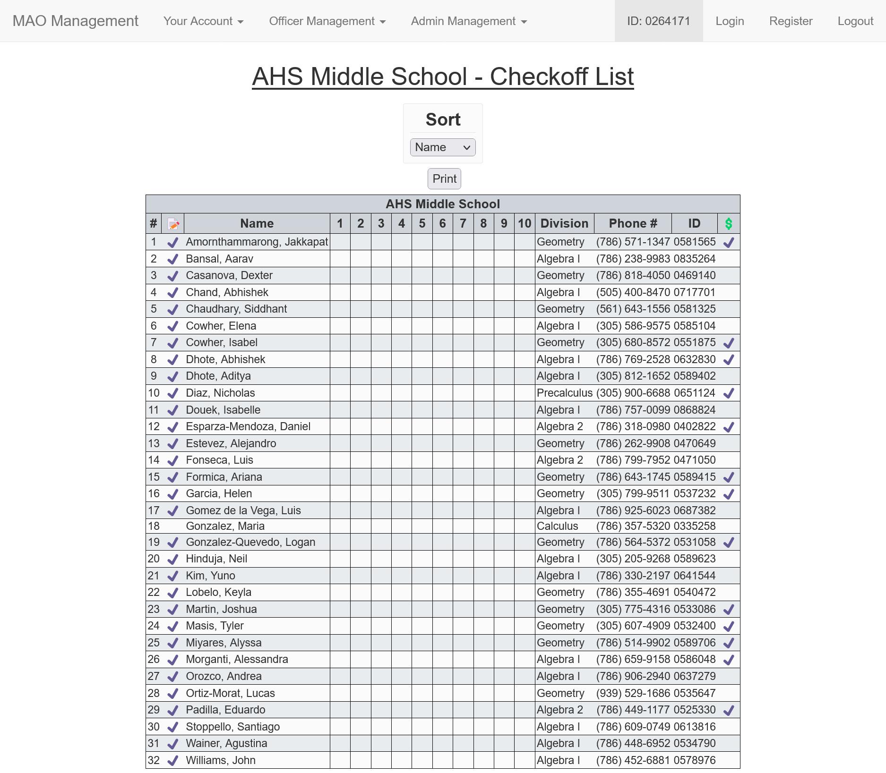
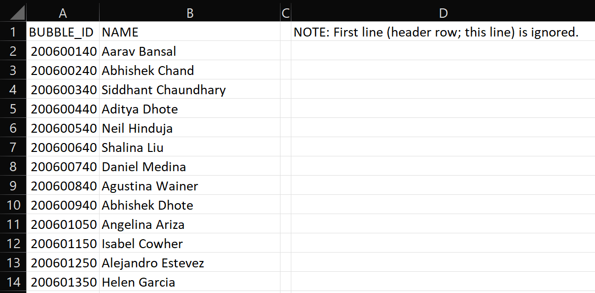

# MAO-Management

Made with love for Doral Academy MAO.

## Installation Instructions

1. Upload a copy of the latest release into your `public_html` directory.
2. Extract!
3. Go to phpMyAdmin and create a database.
4. Import `mao.sql` into your newly created database.
5. Edit `config.ini` with the appropriate SQL database and email information.
6. Move `./phpMyBackupPro/global_conf.php/` to `./../files/`.

## To-do

- Calendar & Login Form:
    - Add calendar option in `config.ini`
    - Add instructions for calendar IFrame
    - Fix styling for calendar and login form if calendar is not being used

- Login Page Background:
    - Add instructions to change background

- Competition Tracker:
    - Competition tracker deselect page should have statistics on all competitions

## Introduction

### Account Registration & Access

#### Register

Register your account with your 7-digit school ID. After being registered, you will be redirected to the login page and
your login code will be sent to your email.

#### Login

If you don't already have your current login code, enter your ID under __Get a Login Code__ and click _Email Code_.

To login, enter your ID and current login code.

__Note:__ Each login code is a random 6-digit uppercase hexadecimal number.

### Your Account

#### Account Information

This page displays the user's current account information. Students may update each section at a time. The information
in red is only editable by officers and admins.

#### Competition Selections

This page allows competitors to "opt-in" (select) which competitions they would like to attend and their current
registration, payment, form, bus, and room status. Once a student selects to go to a competition, they will appear in
the competition's selection report (explained later).

__Note:__ Just because a student selects to go to a competition does not mean they will. An officer must approve their
selection by registering them to the competition (explained later).

#### Transactions

All current transactions, outstanding or otherwise, are shown here. The red in the __Total Owed__ column indicates that
money is owed by the account and green indicates that money is owed to the account.

The _Archive_ button moves a transaction to a separate `table` to keep receipts of all transactions made.

__Note:__ The __Actions__ column is only viewable and usable by officers and admins. The __Add Transaction(s)__ button
will be explained later. Each transaction has a log that records all update made to a transaction and is only viewable
by the admin (shown later).

### Officer Management

#### Update Accounts

The red fields mentioned before in a student's __Update Account Information__ page can be edited by officers and admins.

#### Delete Accounts

It does what you think it does!

#### Manage Payments

You can create new payments, and update and delete existing ones.

__Note:__ The description is shown as HTML! New lines are represented by ` `.

#### Transactions

By clicking the "Add Transaction(s)" button mentioned before, a popup windows will appear that will allow an officer or
admin add another transaction such as a club sweater.

__Note:__ In the event that a transaction may require additional information such as a shirt size (if the purchased size
is different that the one found in the student's account info) or receipt number, the transaction's __Modifier__ box may
be used.

#### Manage Competitions

You can create new competitions, and update and delete existing ones. The fields that are selected are shown in the
__Competition Tracker__ and in the competition _reports_ (shown later).

__Note:__ The description is shown as HTML! New lines are represented by ` `.

#### Competition Tracker

* __Sort By__ - Sort Registered Students List:
    * Name (Default),
    * Grade,
    * Division, or
    * ID

* _Reports_:
    * __Selections__
      

  > This report shows students that have selected to go to this competition. An officer or admin can approve (registers
  student to competition, a student's selection, deny (removes the student's selection) a student's selection, or
  approve all students' selections (__Add All__ button).

    * __Posting__
      

  > This report is usually posted outside the sponsor's classroom.

    * __Checkoff List__
      

  > This report is usually taken on the bus and to the competition and is used to keep track of all student's on a
  competition and contains the student's contact information and competition status.

* __Other Actions__:
    * __Add__
  > Here, you can add a student that is not already registered to the competition.

    * __Create Bubble Sheets__
      

  > This ___magic___ button creates the bubble sheets for all students registered to the competition. The team bubble is
  left blank so that it can be bubbled when team is decided (usually at the competition).

#### Bubbles From File

You can make non-FAMAT bubble sheets using a CSV file.

#### Custom Bubble Sheets

_WIP!_

### Admin Management

#### Backup

Logging in with your database username and password allows you to backup your MAO database to `./../files/export`.

#### Table Dump

This allows admins to dump tables in the MAO database as HTML tables.
